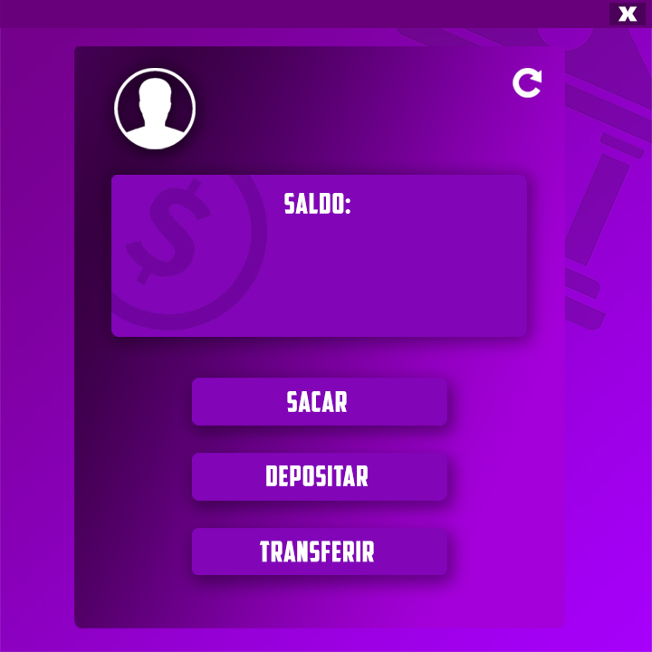
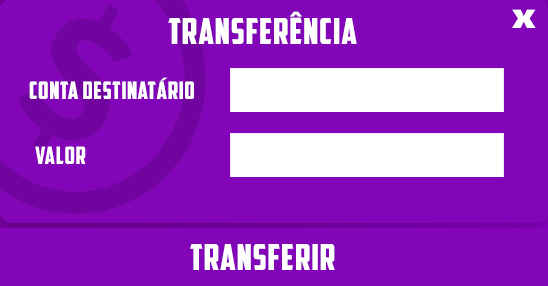

# JavaSQL-Bank
Aplicação de um sistema de contas bancárias, feito em Java e MySQL.
Conta com um banco de dados hospedado em Nuvem, na AWS.

## Cadastro
Conta com um sistema de cadastro, que gera automaticamente o numero da conta do usuario, armazenando em nuvem na AWS. 
 
## Login
Apos o cadastro a conta do usuário estará armazenada no banco de dados, possibilitando-o de acessar sua conta. 
 
## Tela Principal
Conta com uma tela principal mostrando os serviços que a aplicação oferece. 

## Saque
 Conta com um sistema de saque, que atualiza seu saldo no banco de dados.
## Deposito
 Conta com um sistema de depósito, que atualiza seu saldo no banco de dados.
## Transfêrencia
 Conta com um sistema de transfêrencia entre as contas, necessitando do numero da conta que o usuario deseja transferir e o valor. 
 

# Arquivo .JAR
Disponivel na pasta dist/JavaSQLBank.jar

